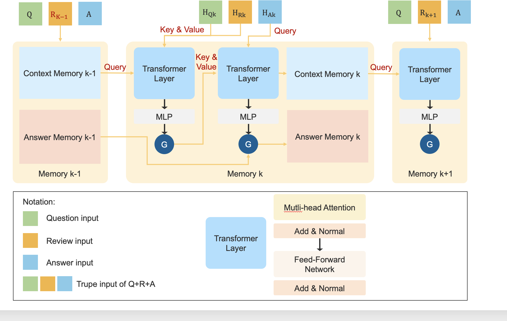

# BRIDGE: BERT-based Review Integration with Dual Generative Evidence

  

## Overview
This project focuses on developing a model capable of performing Question-Answering (QA) tasks across multi-category product reviews, encapsulating the model as an API to enable rapid Q&A through a ChatBot UI. <b><u>B</u></b>ERT-based <b><u>R</u></b>eview <b><u>I</u></b>ntegration with <b><u>D</u></b>ual <b><u>G</u></b>enerative <b><u>E</u></b>vidence (BRIDGE), as the core component of the project, excels in multi-turn, context-aware question answering. It builds upon BERT as a language encoder, incorporating a hierarchical memory layer to preserve contextual representations, and is equipped with a decoder that generates answers based on the question and contextual memory. 

  

<b>Figure 1. The architecture of our proposed model.</b>

## Quick Start

## Project Scope
This project follows a 4-week implementation plan for the project from topic selection to Demo delivery.
### Week 1 Brainstorm & Data Preparation
- **Core Objective:** Confirm the project direction, complete data preprocessing, and select the baseline model
- **Key Tasks:**
  - Brainstorm about different tasks or topic in the field of NLP
  - Discuss on the topic and select one to start
  - Acquire the Amazon product review dataset, filter target categories, and construct a dataset subset
  - Perform data preprocessing: deduplication, cleaning meaningless reviews, and stopword removal

### Week 2 Model Construction & Engineering
- **Core Objective:**  Reproduce and optimize the baseline model, and complete model API encapsulation
- **Key Tasks:**
  - Construct the BRIDGE model and tuning the hyperparameters
  - Conduct model functional testing and performance optimization to meet QA accuracy requirements
  - Encapsulate the model into an API interface to support external calls (adapting to subsequent frontend connection)

### Week 3 Frontend/UI Development & Integration
- **Core Objective:** Complete ChatBot frontend development and realize frontend-backend integration
- **Key Tasks:**
  - Design the ChatBot interactive interface (supporting product category selection, question input, review upload, and answer display)
  - Develop frontend pages (based on Vue/React framework) to ensure a concise and user-friendly interface
  - Integrate backend API interfaces to realize the full workflow of "frontend input → interface request → backend inference → frontend display"
  - Integration testing: Fix issues such as cross-domain, response delay, and format incompatibility

### Week 4 Testing & Outcome Presentation
- **Core Objective:** Complete full-process testing and deliver Demo videos and presentation materials
- **Key Tasks:**
  - Comprehensive testing: Cover scenarios such as different product categories, complex questions, and multi-review input; optimize answer accuracy and fluency
  - Produce Demo video: Record interface operation process, core function demonstration, and typical QA cases
  - Create project presentation PPT: Sort out project background, technical architecture, implementation process, and achievement highlights
  - Organize GitHub repository documentation (README, user guide, code comments) 
